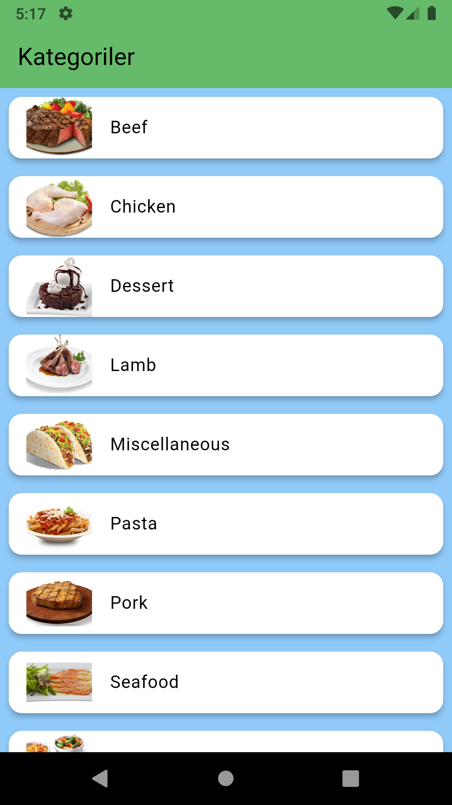
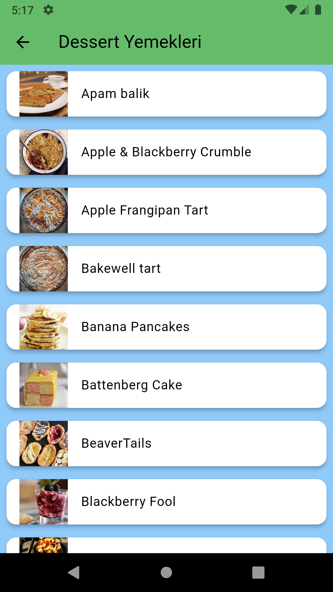
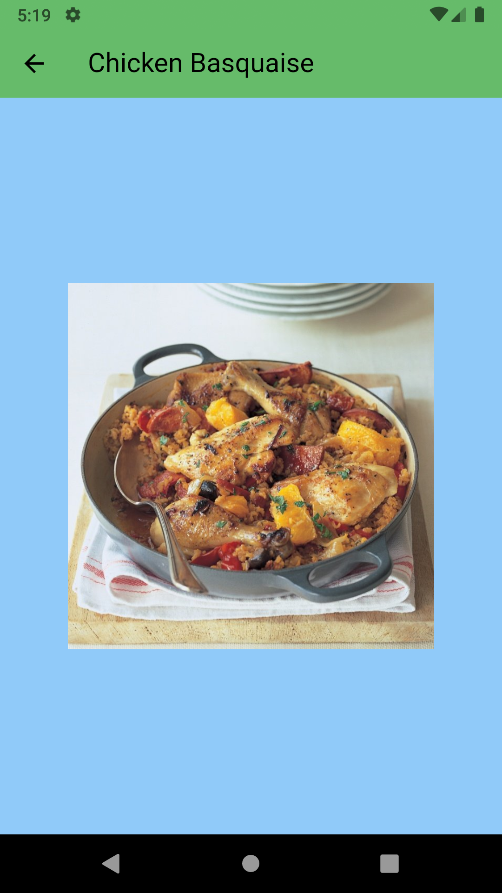

# mobil_application_course_project

Erciyes Üniversites Mobil Aplication Final Projesi
Konu: https://www.themealdb.com REST ile JSON biçiminde veri okuma yapabilen uygulama.

####

Okul: Erciyes Üniversitesi

Bölüm: Bilgisayar Mühendisliği

Ders: Mobile Application Development

Öğretim Üyesi: Dr. Öğr. Üyesi Fehim KÖYLÜ

##

## Screenshot 📷
-📌 *ANA SAYFA*
<pre>
                 
</pre>

-📌 *Kategori Sayfası*
<pre>
           
</pre>

## Özellikler 🗃
Bu uygulama, mobil geliştirmedeki en yeni araçları ve uygulamaları içerir!

- *Flutter*
- *Http Request*
- *Navigation Bar*
- *Routes*
- *API* - [The MealDB](https://www.themealdb.com/api.php)

####
####

Erviyes University Final Project
Konu: A food application that can read data in JSON format with REST from https://www.themealdb.com.

University: Erciyes University 

Department: Computer Engineering

Course: Mobile Application Development 

Faculty Personnel: Dr. Lecturer Member Fehim KÖYLÜ

##
<h1>

A food app that shows recommended dishes and categories. 

 
 
The Meal
</h1>

## Screenshot 📷
-📌 *Home Screen*
<pre>
                 
</pre>

-📌 *Category Screen*
<pre>
           
</pre>

## Features 🗃
This app features all the latest tools and practices in mobile development!

- *Flutter*
- *Http Request*
- *Navigation Bar*
- *Routes*
- *API* - [The MealDB](https://www.themealdb.com/api.php)